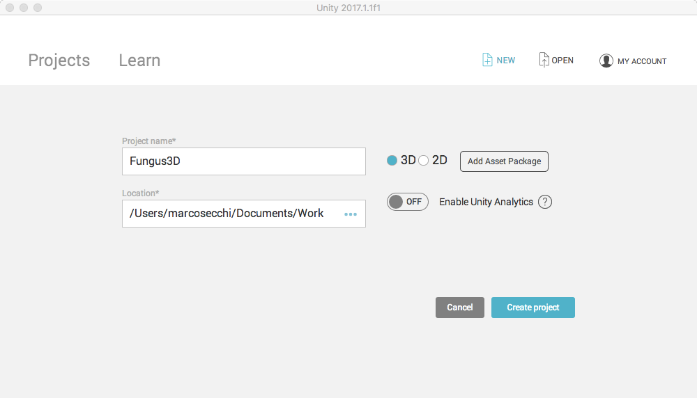
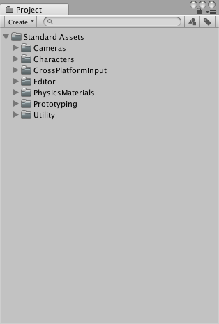
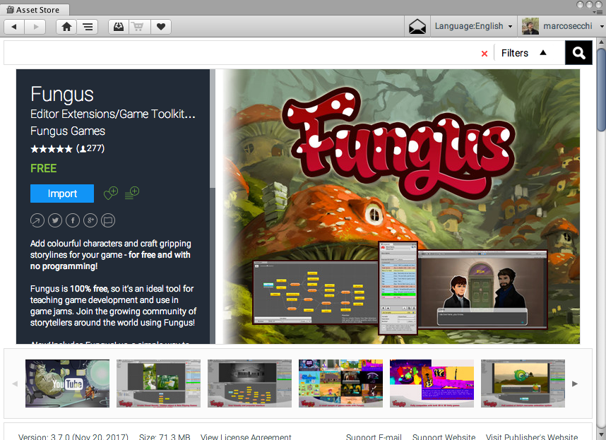
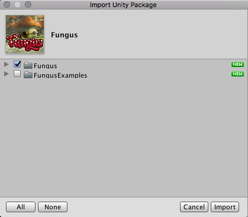

# Setup

## Creazione di un nuovo progetto

Prima di tutto è necessario creare un nuovo progetto con Unity che, nel mio caso, ho chiamato _Fungus3D_.

## Importare gli Asset

### Importare gli Standard Assets

Dal menu _Assets > Import Package_, importare i seguenti pacchetti:

* **Cameras**
* **Characters**
* **Prototyping**

Da notare che verranno caricati altri pacchetti correlati come, ad esempio **Utility**.

### Importare Fungus

Dopo aver aperto l'_Asset Store_ (_Window > Asset Store_), cercare Fungus e scaricarlo.

> E' possibile [scaricare l'estensione anche da browser](https://www.assetstore.unity3d.com/#!/content/34184/directpurchase?aid=1011lHJn) (che, a sua volta, aprirà automaticamente Unity3D).

Importare solamente _Fungus_ (e non _Fungus Examples_).

Siete ora pronti a creare il prototipo della scena.