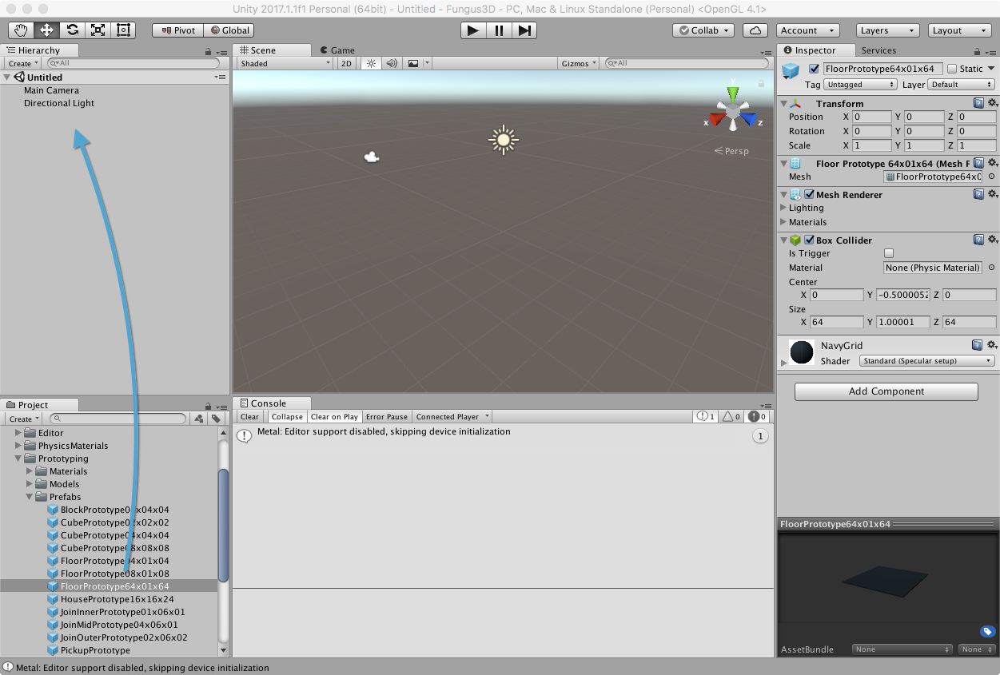
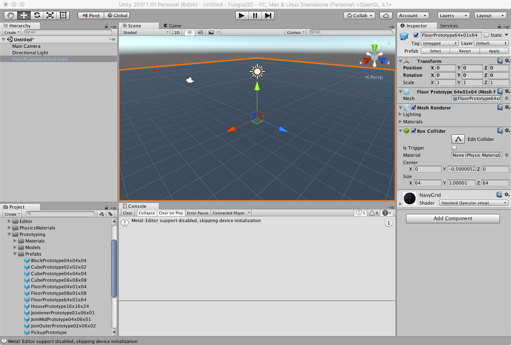
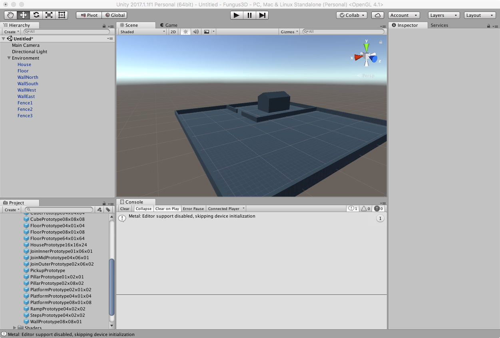
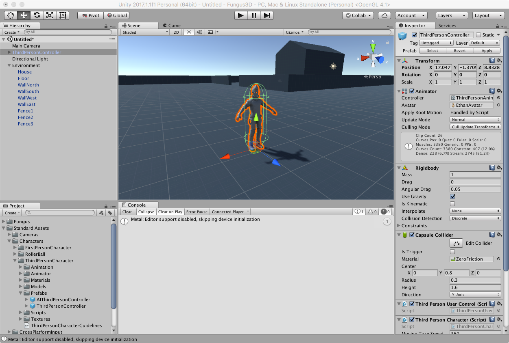
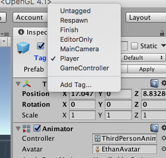
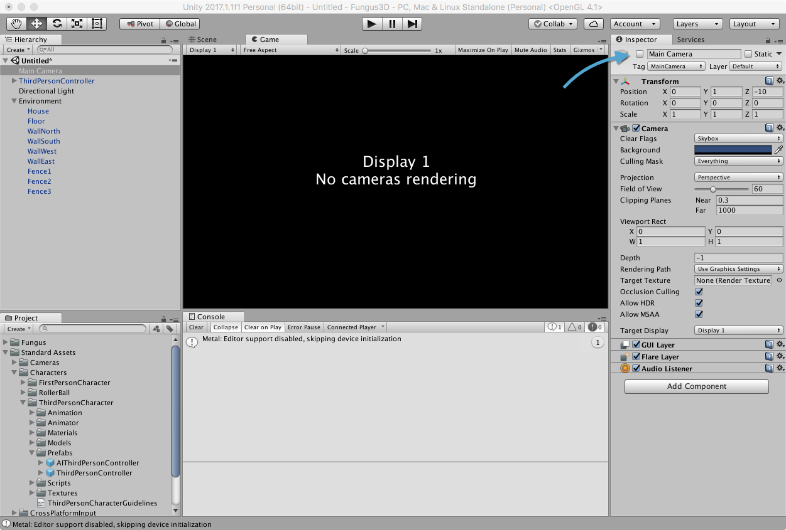
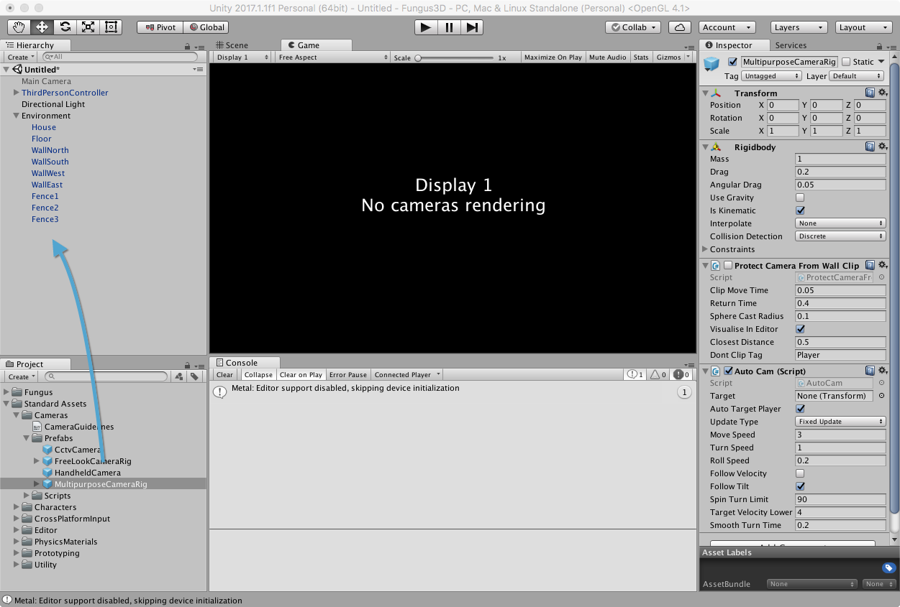
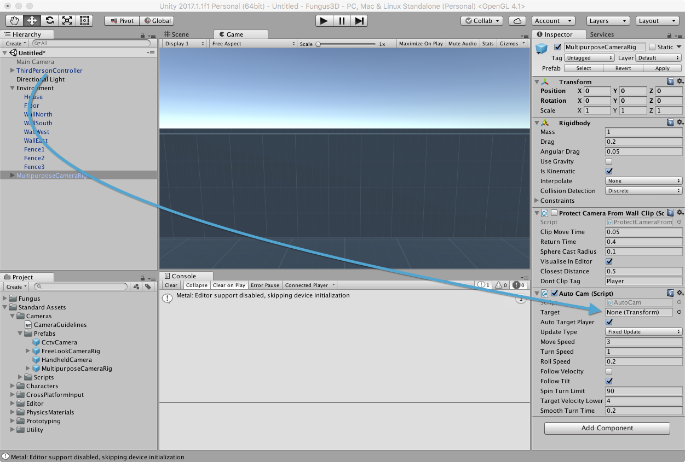
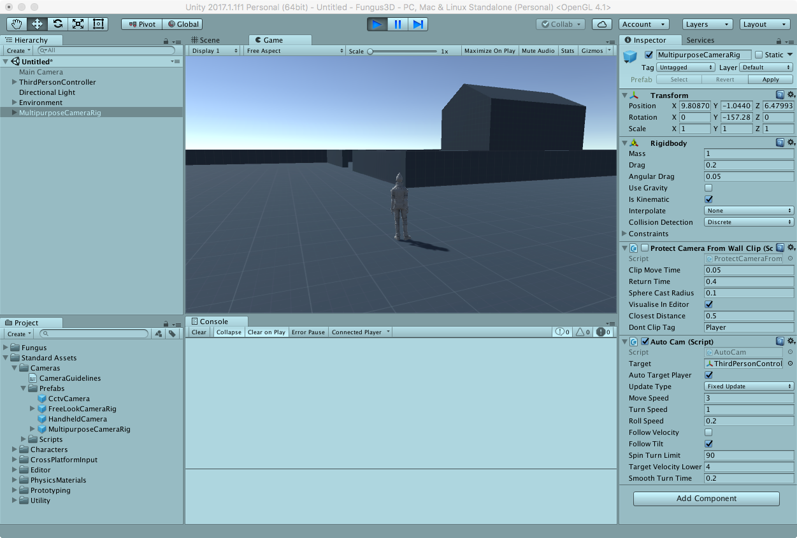

# Creazione della Scena

Andremo ora a creare un semplice prototipo di scena, che servirà come base per le lezioni successive.

## Creazione dell'Ambiente

Per prima cosa andremo ad aggiungere alcuni elementi al nostro scenario: datta cartella _Standard Assets > Prototyping > Prefabs_ trascinare il prefab _FloorPrototype64x01x64_ nella finestra _Hierarchy_, per creare un pavimento.

Aggiungiamo ora, sempre dalla stessa cartella dei prefab, alcuni elementi, per rendere la scena meno banale. La mia scena risulterà come di seguito, ma siete ovviamente liberi di creare l'ambiente a voi più congeniale!

Per comodità, creiamo un gameobject vuoto (_GameObject > Create Empty_), che rinominiamo (nell'_Inspector_) _Environment_ e dove andremo a spostare tutti gli elementi dell'ambiente.

## Aggiunta del Personaggio (Third Person Controller)

Dalla cartella _Standard Assets > Characters > ThirdPersonCharacter > Prefabs_ trasciniamo direttamente in scena il _prefab_ chiamato _ThirdPersonController_.

Selezionando _ThirdPersonController_ in _Hierarchy_, aprire il menu _Tag_ e scegliere _Player_.

## Sostituzione della Camera

Selezioniamo la _Main Camera_ in scena, e disabilitiamola tramite il checkbox di fianco al nome, nell'_Inspector_ (La finestra _Game_ dovrebbe mostrare il messaggio _No cameras rendering_).

Dalla cartella _Standard Assets > Cameras > Prefabs_, trasciniamo nella finestra _Hierarchy_ il prefab _MultipurposeCameraRig_.

> Il prefab MultipurposeCameraRig contiene una camera molto più flessibile di quella fissa, che seguirà il proprio target ovunque vada.

Come ultimo passo, selezionare _MultipurposeCameraRig_ nella _Hierarchy_ e trascinare il _ThirdPersonController_ dalla _Hierarchy_ (non dal pannello _Project_!) nel campo _Target_ del componente _Auto Cam_.

## Provare la Scena

Sarà ora possibile provare la scena, tramite il pulsante _Play_ nella barra degli strumenti.

