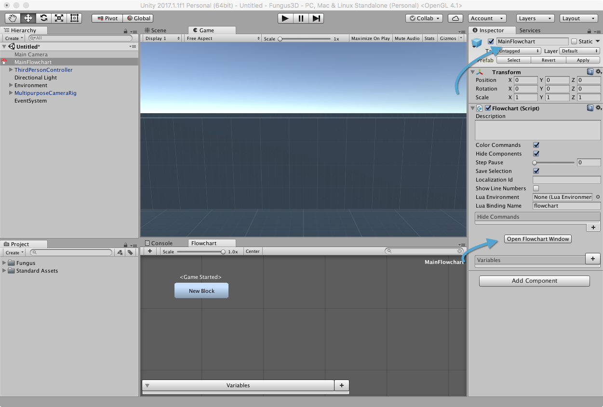
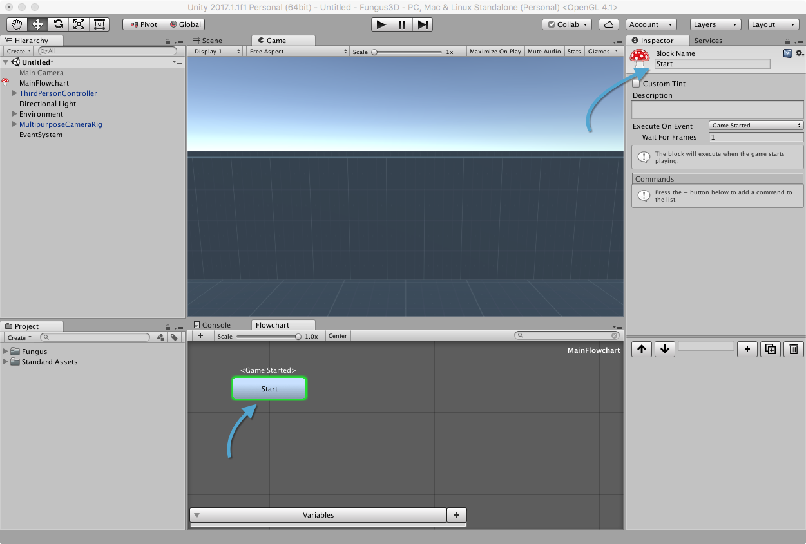
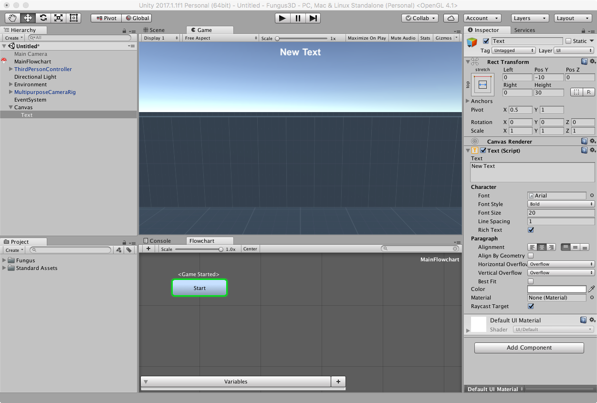
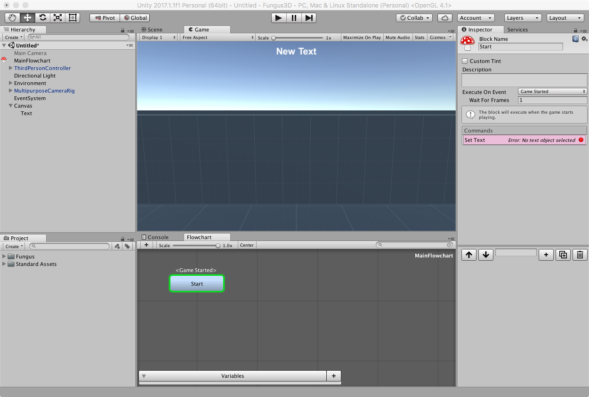
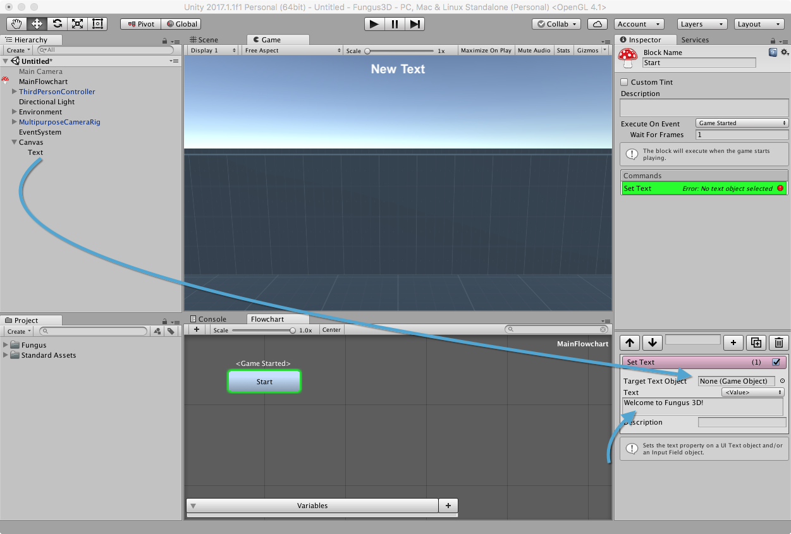

# Aggiungere un Flowchart

Andremo ora ad aggiungere un [Flowchart](http://files.snozbot.com/games/fungus/docs/flowcharts/index.html) di Fungus, che andremo ad utilizzare nelle lezioni successive, assieme ad un campo di testo che utilizzeremo per visualizzare una serie di messaggi.

## Creazione di un Flowchart 

Dal menu _Tools > Fungus > Create_ selezionare _Flowchart_, che aggiungerà un _Flowchart_ in scena. Selezioniamolo nella _Hierarchy_ e clicchiamo sul pulsante _Open Flowchart Window_: verrà aperto il pannello corrispondente.

Rinominiamo l'oggetto come _MainFlowchart_ dall'_Inspector_.

### Rinominare il Blocco 'Start'

Selezioniamo, all'interno del _Flowchart_, il blocco (l'unico, al momento) _NewBlock_ e, dall'_Inspector_ rinominiamolo _Start_.

## Creazione di un Campo di Testo

Dal menu _GameObject > UI_ selezionare _Text_, che genererà un campo di testo nella scena. Selezionatelo e modificatelo secondo i vostri gusti dal pannello dell'Inspector. Il mio ha l'aspetto nella figura riportata in seguito.

## Scrivere un messaggio di Benvenuto

Andremo ora ad aggiungere un messaggio di benvenuto al testo, per sincerarci che tutto funzioni correttamente. Selezioniamo il blocco _Start_ all'interno del nostro _Flowchart_ e, tramite il pulsante _+_ nell'_Inspector_ aggiungiano il comando _UI > Set Text_.

Selezioniamo il comando e trasciniamo il gameobejct _Text_ dalla _Hierarchy_ nel campo _Target Text Object_. Aggiungiamo infine nel campo _Text_ un messaggio di benvenuto.

