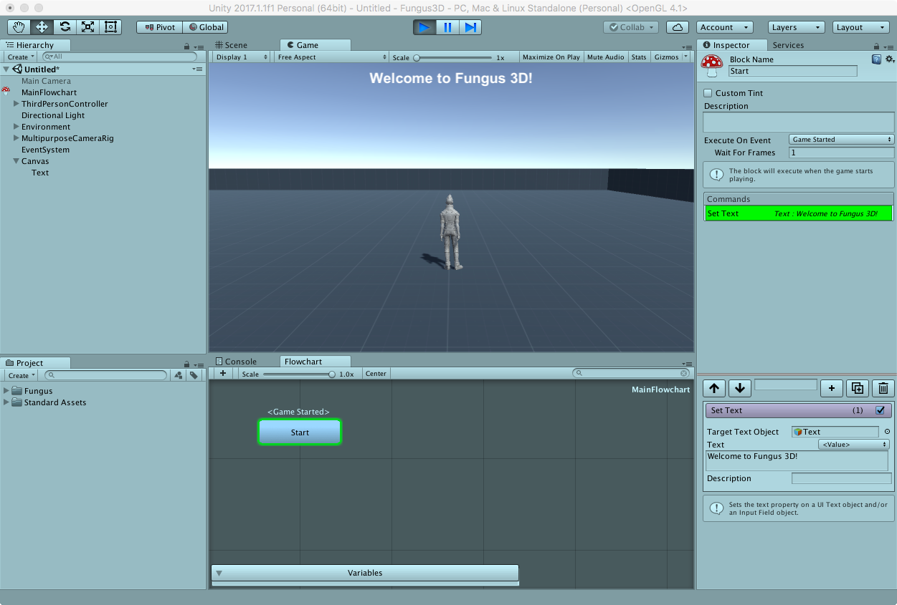

# Testing the Scene

Click the _Play_ button in the toolbar just to be sure everything is working fine.

## Save the scene!

Save the scene so your work won't be lost.

## Project download

You can download the complete lesson files here: [Tech.io Fungus 3D Tutorial](https://github.com/marcosecchi/techio-tutorial-fungus-pickups/archive/part_01.zip).
