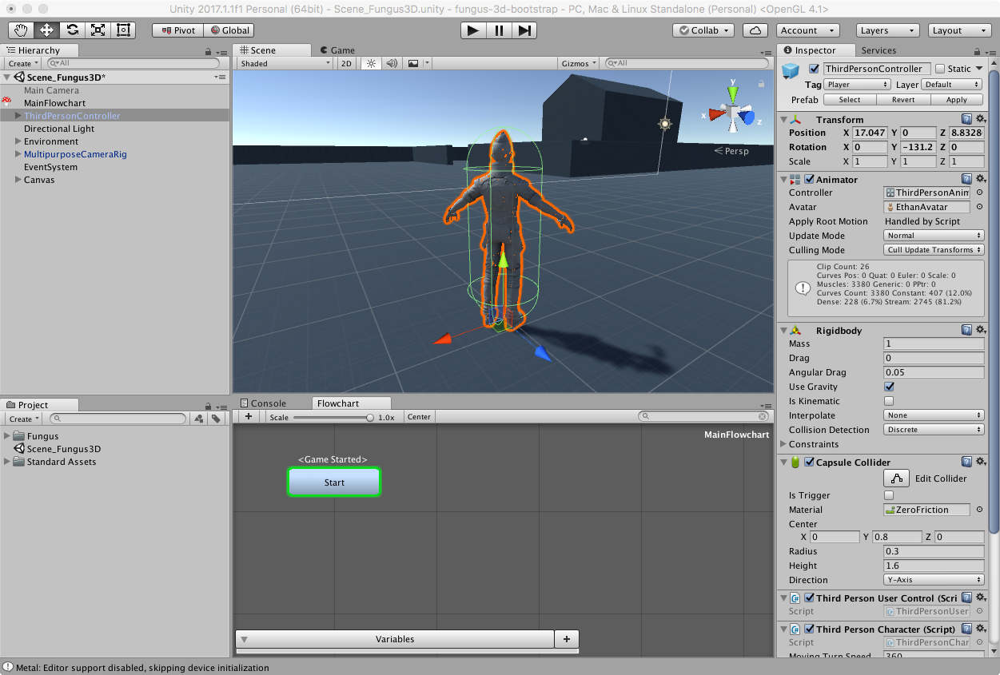
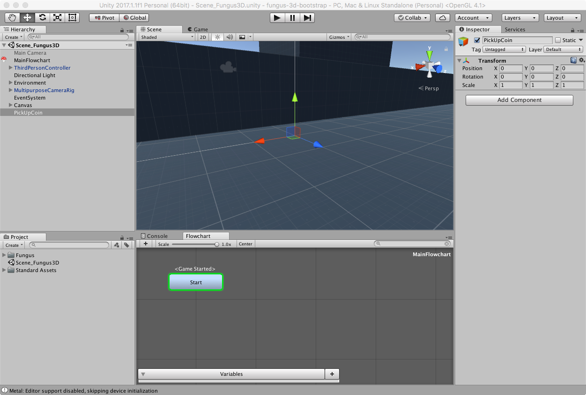
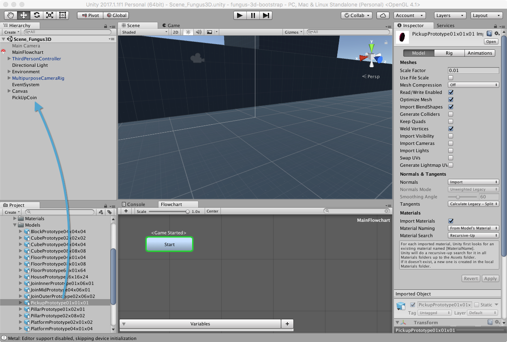
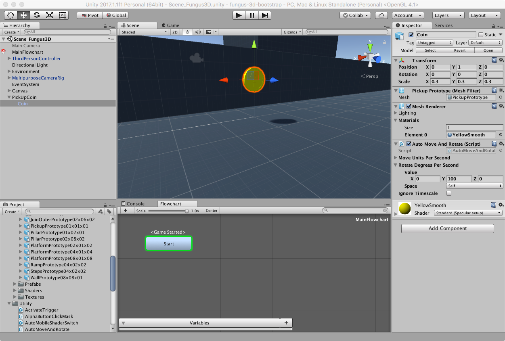
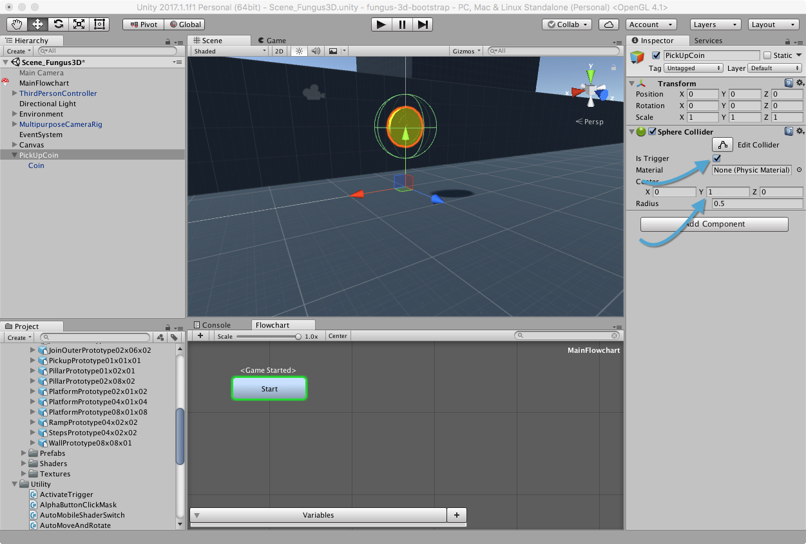

# Creazione del GameObject

## Aprire la Scena

Per prima cosa andiamo ad aprire la scena che abbiamo creato nella lezione precedente.

## Creare la Moneta

Creiamo un GameObject vuoto (_GameObject > CreateEmpty_), posizioniamolo in _(0, 0, 0)_ e rinominiamolo _PickUpCoin_.

Dalla cartella _Standard Assets > Prototyping > Models_ trasciniamo _PickupPrototype01x01x01_ all'interno di _PickUpCoin_, in modo tale che sia un suo _Child_.

> Non stiamo utilizzando il prefab del coin perché ci interessa solamente il modello. Il _Collider_ lo inseriremo successivamente.

Selezioniamo _PickupPrototype01x01x01_, rinominiamolo _Coin_, posizioniamolo in _(0, 1, 0)_ e scaliamolo al 30% _(0.3, 0.3, 0.3)_.

Sempre con il _Coin_ selezionato, nell'Inspector clicchiamo il pulsante _Add Component_ e selezioniamo _Scripts > UnityStandardAssets.Utility > AutoMoveAndRotate_ per aggiungere un effetto di rotazione alla moneta.

Nel Campo _Rotate Degrees Per Second_ modifichiamo il valore _Y_ a 100.

Come ultimo passo, cambiamo il materiale del _Mesh Renderer_ da _Pink Smooth_ a _Yellow Smooth_.

Il risultato finale dovrebbe essere come mostrato in figura.

Se proviamo a lanciare la scena, dovremmo vedere la moneta ruotare all'infinito.

> Salvare la Scena.

## Aggiungere il Trigger

Selezioniamo ora il _parent_ del coin, e cioè _PickUpCoin_: andremo ad aggiungere un _Collider_ in modo da poter attivare un trigger nel momento in cui il nostro personaggio entrerà a contatto con esso.

Clicchiamo su _Add Component_ e selezioniamo _Physics > Sphere Collider_. Trasformiamolo in un [Trigger](https://docs.unity3d.com/Manual/CollidersOverview.html) cliccando sul checkbox _Is Trigger_ e, nel campo _Center_ modifichiamo il valore di _Y_ a 1, in modo tale che si posizioni esattamente intorno alla moneta.

> La scelta dello _Sphere Collider_ è dovuta al fatto che ben si presta alla forma che produce la moneta mentre ruota.

Siamo ora pronti ad aggiungere interattività alla nostra moneta.