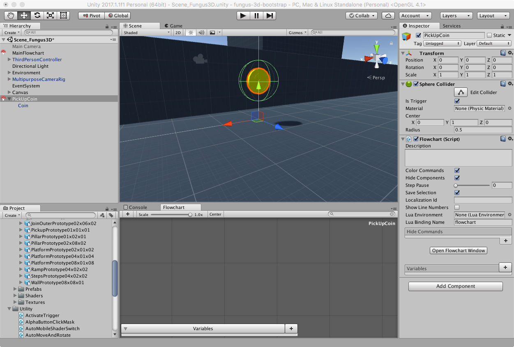
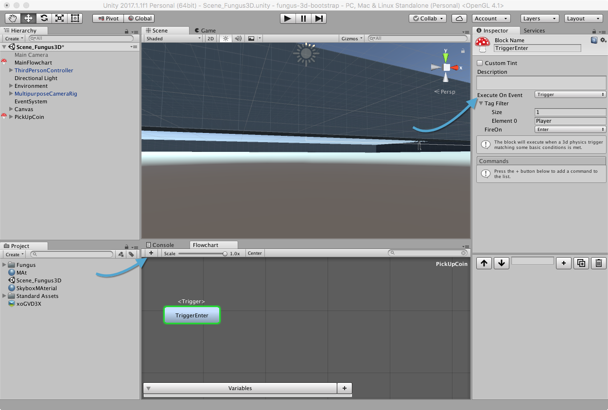
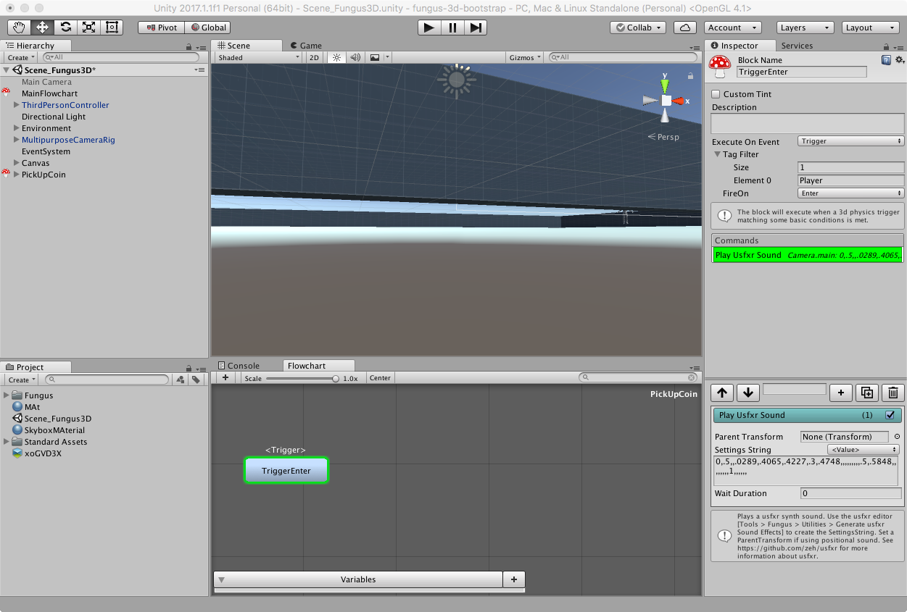
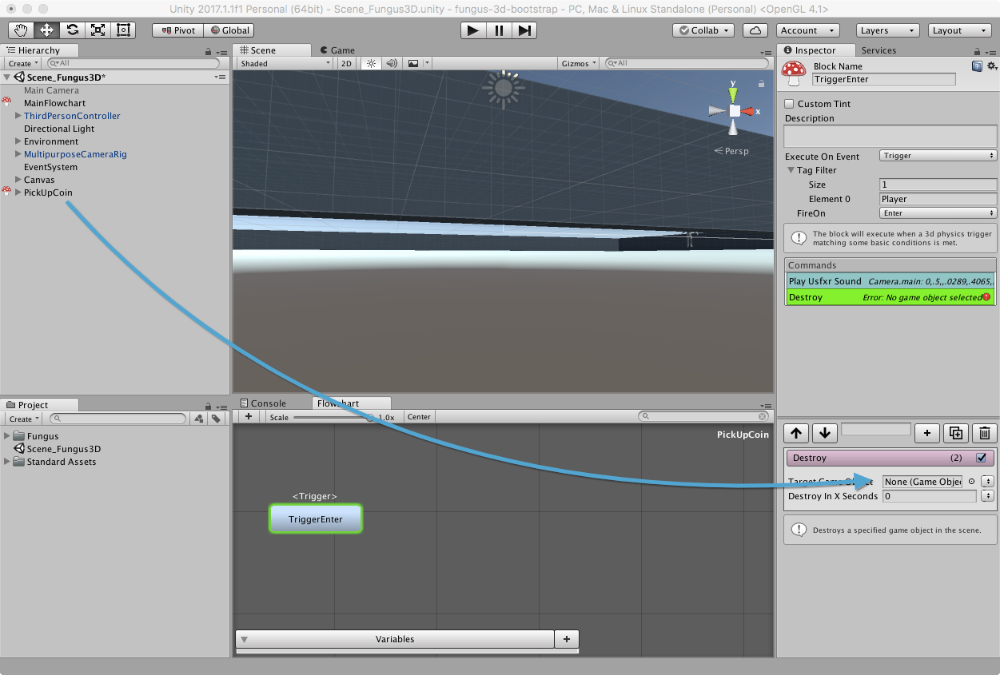

# Controllare la Logica del PickUp

Andremo ora ad implementare il sistema che permetterà al coin di essere raccolto dal nostro personaggio. Per fare questo, utilizzeremo un [Flowchart](http://files.snozbot.com/games/fungus/docs/flowcharts/index.html) di Fungus, che però sarà inserito all'interno del nostro _PickUpCoin_.

## Aggiungere un Flowchart

Selezioniamo il GameObject _PickUpCoin_, clicchiamo su _Add Component_ e selezioniamo _Scripts > Fungus > Flowchart_: clicchiamo poi su _Open Flowchart Window_ per visualizzare il _Flowchart_ in questione.



## Aggiungere il Blocco 'Trigger Enter'

Creiamo ora un blocco di comandi, tramite il pulsante _+_ nella finestra del _Flowchart_ e rinominiamolo _TriggerEnter_

Il blocco deve attivarsi all'evento _MonoBehaviour > Trigger_ (_FireOn > Enter_), cioè quando un elemento in scena entra nel _Trigger_ del GameObject.

Imponiamo al _TagFilter_ il valore 1 e, nell'_Element 0_ inseriamo "Player" (attenzione alla maiuscola!), in modo che solamente il Controller (che abbiamo taggato nella lezione precedente come "Player").



## Aggiungere i Comandi

Siamo ora pronti ad inserire i comandi nel nostro blocco.

### Aggiungere un Audio Usfxr

Per prima cosa aggiungiamo il comando _Audio > Play Usfxr Sound_. Nel campo _Settings String_ inseriamo il seguente valore:

```0,.5,,.0289,.4065,.4227,.3,.4748,,,,,,,,,.5,.5848,,,,,,,,1,,,,,,```

> E' possibile creare il proprio effetto sonoro tramite l'editor di effetti di Fungus, selezionando _Fungus > Utilities > Generate usfxr Sound Effects_ (per maggiori informazioni, consultare [la pagina del progetto](https://github.com/zeh/usfxr)).



### Rimuovere il PickUp

Subito dopo l'effetto audio, aggiungiamo il comando _Scripting > Destroy_ e trasciniamo il gameobject _PickUpCoin_ dalla scena nel campo _Target Game Object_.



Se lanciamo la scena e muoviamo il nostro personaggio sulla moneta, dovremmo udire il suono generato e la successiva distruzione della moneta dalla scena.

Siamo ora pronti a creare un prefab dal nostro pickup.