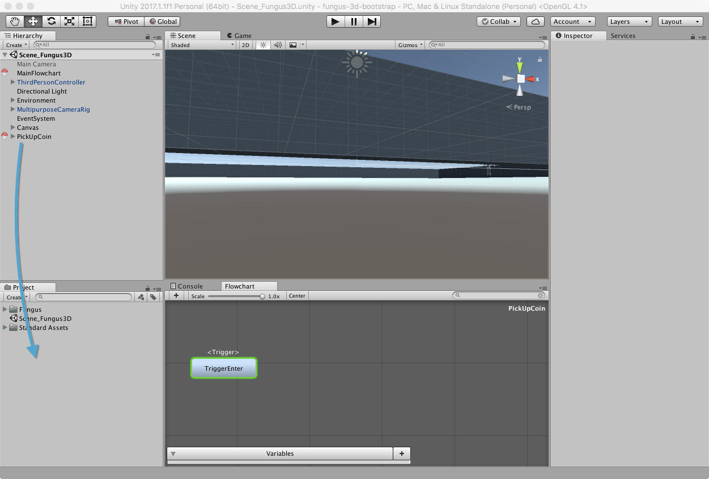
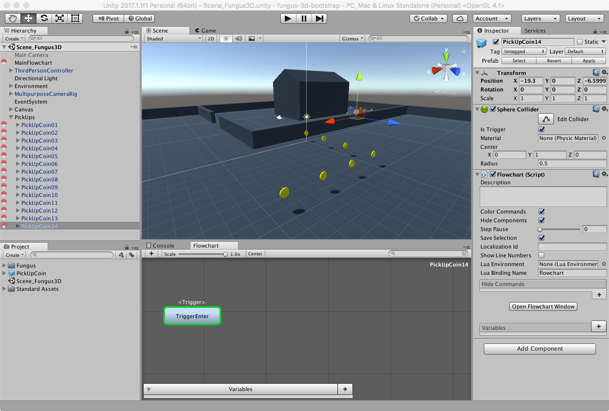

# Creare un Prefab

## Creare il Prefab del PickUp

L'operazione di creazione del prefab è quella standard di Unity3D: basta trascinare l'oggetto dalla _Hierarchy_ nella finestra _Project_.

## Aggiungere i Prefab nella Scena

Siamo ora pronti a creare una serie di prefab in scena: ognuno avrà il proprio _Flowchart_ che gestirà l'evento di pickup.

Per comodità, ho raccolto tutti i pickup in un gameobejct chiamato _PickUps_.

