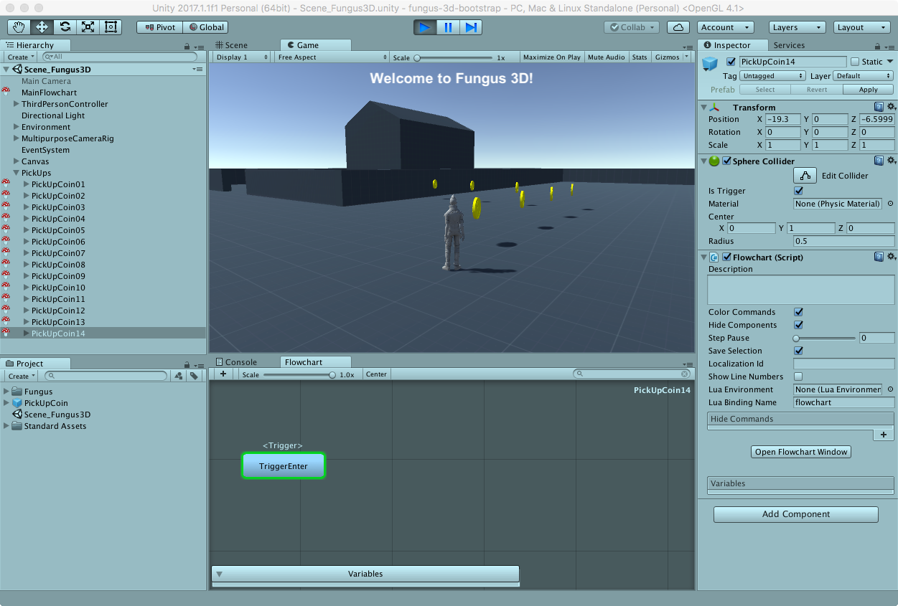

# Provare la Scena

Lanciamo il _Play_ per sincerarci che tutto funzioni a dovere.

## Salvare la Scena!

Salviamo la infine scena per utilizzarla nelle lezioni future.

## Progetto Completo della Lezione

E' possibile scaricare il progetto completo di questa lezione: [Tech.io Fungus 3D Tutorial](https://github.com/marcosecchi/techio-tutorial-fungus-pickups/archive/part_02.zip).
