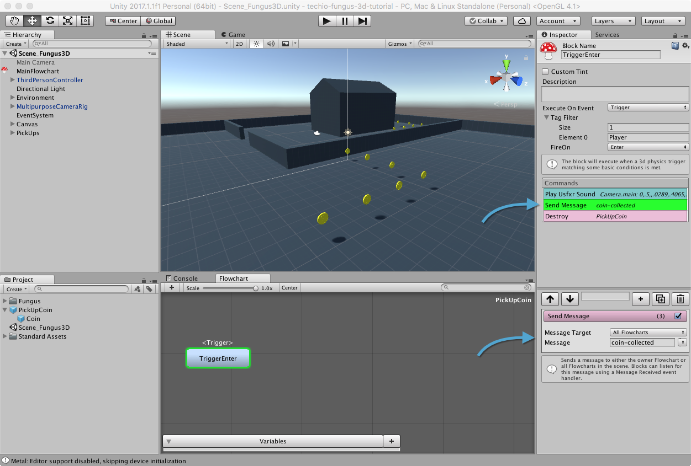

# Spedire un Messaggio

# Aggiungere il Comando SendMessage al Flowchart

Selezioniamo il prefab PickUpCoin all'interno del nostro progetto ed apriamo il suo _Flowchart_.

> Modificare il prefab ci garantisce che tutti i pickup in scena verranno aggiornati.

Aggiungiamo il comando _Flow > Send Message_ e spostiamolo prima del comando _Destroy_.

> Se il comando rimane dopo _Destroy_, non verrà mai eseguito, perché il _Flowchart_ verrà eliminato prima che il comando stesso venga eseguito.

Dal menu _Message Target_ selezioniamo _All Flowcharts_ (in modo che il comando possa essere 'ascoltato' anche all'esterno) e, come valore di _Message_, inseriamo _coin-collected_.

> Il testo del messaggio è sensibile a minuscole/maiuscole, quindi facciamo attenzione a cosa scriviamo!

Tutti i nostri coin in scena dovrebbero ora avere aggiunto il comando _Send Message_.