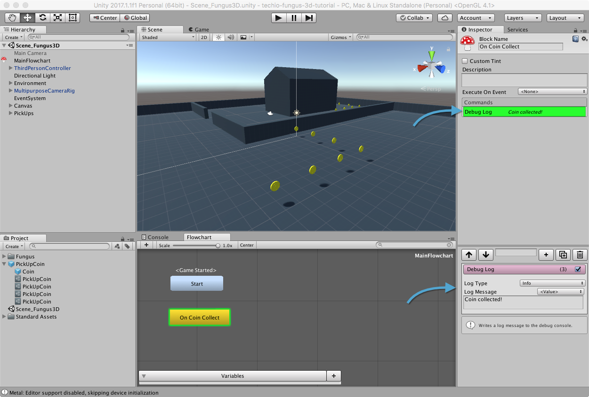
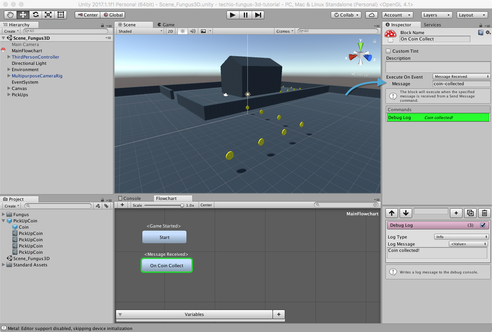

# Ricevere un Messaggio

Modificheremo ora il _MainFlowchart_, in modo che rimanga in attesa del messaggio.

## Creare il Blocco

Selezioniamo _MainFlowchart_ dalla scena ed apriamo la finestra di editing. Aggiungiamo un nuovo blocco che rinomineremo _On Coin Collect_ ed al suo interno aggiungiamo un comando _Debug Log_ con un messaggio di nostra scelta (io ho scelto 'Coin collected!').

> Il comando _Debug Log_ ci permette di tracciare alla [Console](https://docs.unity3d.com/Manual/Console.html) informazioni, errori e tanto altro. Nel nostro caso utilizzeremo questo sistema per essere sicuri che il blocco venga eseguito.

## Aggiungere l'evento MessageReceived

Sempre all'interno del blocco _On Coin Collect_, selezioniamo dal menu _Execute On Event_ il valore _Scene > Message Received_ e, nel campo _Message_ inseriamo lo stesso messaggio che abbiamo spedito in precedenza (_coin-collected_).

Salviamo la scena e lanciamola: ogni volta che raccogliamo una moneta, alla console dovrebbe apparire il messaggio corrispondente.
