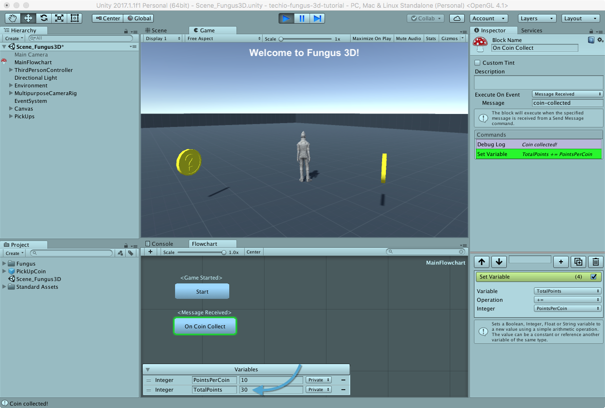

# Tracking Points

Let's show how many points the player is getting for collecting coins.

## Creating Variables

First of all, we need two variables for tracking:

* how many points a coin is worth
* how many points the player has collected

Open _MainFlowchart_ and, from the _Variables_ section, click the _+_ button twice, creating two _integer_ variables called _PointsPerCoin_ and _TotalPoints_.
Assign a value of 10 to _PointsPerCoin_.


## Update Points 

We already know when a coin has been collected... so we are now ready to assign points.
Select the _On Coin Collect_ block and add a _Variable > Set Variable_ command, that let us assign a value to a variable.
Set the variable to _TotalPoints_, select _+=_ as the operator (adds a value to the variable) and _PointsPerCoin_ as the value.


Save the scene and play it: each time a coin is collected, _TotalPoints_ will be updated.



## Show Points in the UI

The last thing to do is to show in the UI the updated points the player has gained (we'll use the same text element as the one used for the welcome message).

With the _On Coin Collect_ block selected, add a _UI > SetText_ command, drag the _Text_ element in the _Hierarchy_ panel into the _Target Text Object_ field, and add the following text:

```{$TotalPoints} Punti````

> The syntax _{$variable-name}_ interpolates, during play, the variable value in the text.


